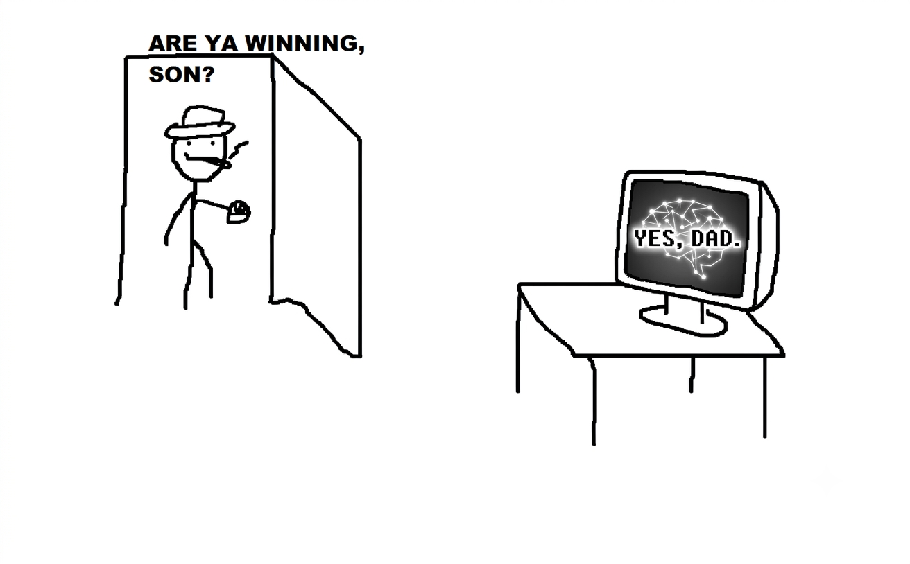

# EmuDevz



🕹️ A game about building emulators! [Check it out!](https://afska.github.io/emudevz)

[](https://www.youtube.com/watch?v=sBhFulSp4KQ)

>  Created by [[r]labs](https://r-labs.io).

## Key features

- Full 🕹️ NEEES emulation guide from scratch
- Interactive 🔨 6502 Assembly tutorial
- Implement 🧠 CPU, 🖥️ PPU, and 🔊 APU in any order
- Play 👾 homebrew games to unlock ROMs
- 🧪 Unit tests, video tests, and audio tests are provided
- 💻 Unix-style shell and code editor
- 🎶 Original retro-synthwave soundtrack
- 📃 Included documentation and in-game dictionary
- 🗣️ Fully localized into English and Spanish
- 🐞 Powerful debugger with:
  * 🐏 Memory viewer
  * 🔢 Instruction log
  * 🏞️ Name tables, CHR, Sprites, Palettes
  * ♒ Individual APU channel views
  * 🎮 Controllers
  * 🗃️ Emulator logging
- 🔭 **Free mode** to use the IDE to develop emulators for other systems!

## Where's the save file?

- Portable: `.devz` files (import/export from _Settings_ menu)
- Web: IndexedDB and LocalStorage
- Steam/Windows: `%USERPROFILE%/AppData/Roaming/EmuDevz`
- Steam/Linux: `$XDG_CONFIG_HOME/EmuDevz`
- Steam/macOS: `~/Library/Application Support/EmuDevz`

## Development

### Install and run

```bash
# [0: install nvm & node]
# - install nvm
# - install the node version listed in `.nvmrc`

# [1: install dependencies]
npm install

# [2: package levels]
npm run package

# [3: add music files (optional)]
# - grab the `music` directory from the `gh-pages` branch
# - put it in `public/music`

# [4: start the dev server]
npm start
```

### Scripts

- Package levels:
  `npm run package`
- Sort locales:
  `node scripts/sort-locales.js`
- Sort dictionary entries:
  `node scripts/sort-dictionary.js`
- Build:
  `npm run build`
- Deploy to GitHub Pages:
  `npm run deploy <GH_USERNAME> <GH_TOKEN>`

### Generate licenses

```
cp pre-licenses.txt public/licenses.txt
yarn licenses generate-disclaimer --prod >> public/licenses.txt
```

### Known issues

These are notes from the January 2026 release on Steam. I hope these issues can be resolved in the future.

#### Windows

- On _Windows 11_, when using a full-screen Electron app with the Steam overlay, [ghost Alt-Tab windows are created](https://github.com/ceifa/steamworks.js/issues/95). As a workaround, fullscreen mode is disabled on Windows.

#### macOS

- The Steam overlay [doesn't seem to work](https://github.com/ceifa/steamworks.js/issues/160).

#### Linux

- The app doesn't boot in [sandbox mode](https://www.electronjs.org/docs/latest/tutorial/sandbox) when launched via Steam. As a workaround, Steam launches the app with `--no-sandbox`.
- The app doesn't boot on [Arch Linux](https://archlinux.org) with the latest [Electron](https://www.electronjs.org/) when using the [Steam Linux Runtime 3.0](https://github.com/ValveSoftware/steam-runtime). As a workaround, Electron _36.9.5_ was used and forced to launch using _X11_ with `--enable-features=UseOzonePlatform --ozone-platform=x11`.
